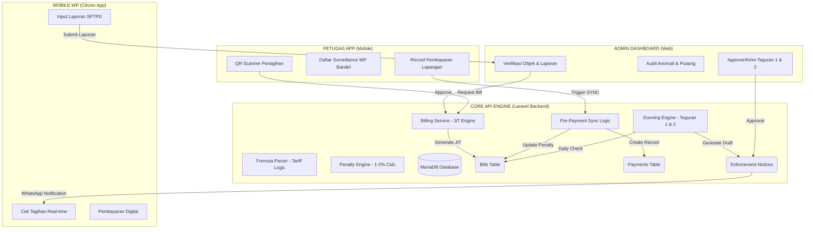

# M-PAD Invoicing Workflow & Performance

Dokumen ini menjelaskan arsitektur, mekanisme teknis, dan alur kerja sistem penagihan (invoicing) M-PAD, mulai dari backend hingga interaksi lintas platform (Admin, Petugas, dan Mobile).

---

## 🗺️ Peta Arsitektur Invoicing (V2)

---

## 🚀 Filosofi: Just-In-Time (JIT) Billing

Berbeda dengan sistem tradisional yang melakukan *pre-generation* tagihan di awal tahun, M-PAD menggunakan pendekatan **JIT Billing**. Tagihan dihitung dan dimunculkan secara dinamis saat sistem membutuhkannya (ketika discan oleh petugas atau dilihat oleh WP).

**Keuntungan:**
- **Efisiensi Database**: Mengurangi jutaan baris record tagihan kosong.
- **Akurasi Real-time**: Perubahan peraturan atau denda langsung tercermin pada perhitungan saat itu juga.
- **Fleksibilitas**: Memungkinkan penyesuaian periode (harian, bulanan, tahunan) tanpa migrasi data besar.

---

## 👥 Alur Kerja per Aktor

### 1. Sisi Admin (Back-Office)
Admin bertanggung jawab atas **Penetapan Awal** dan **Verifikasi Laporan**.
- **Alur Penetapan**: Admin menyetujui pendaftaran objek baru → Sistem otomatis menerbitkan tagihan pertama (Initial Invoice).
- **Alur Self-Assessment**: Admin memverifikasi SPTPD (Laporan Bulanan) yang dikirim WP → Persetujuan laporan memicu pembuatan invoice berdasarkan nominal yang dilaporkan.

### 2. Sisi Petugas (Lapangan)
Petugas menggunakan aplikasi mobile untuk **Penagihan Aktif (Direct Billing)**.
- **Mekanisme**: Petugas memindai QR Code Objek Pajak → Aplikasi memanggil `BillingService` untuk menghitung periode yang belum dibayar.
- **Aksi**: Petugas dapat memilih periode tertentu dan langsung memproses pembayaran di tempat (Tunai/M-POS).

### 3. Sisi WP / Citizen (Mobile)
Wajib Pajak dapat melihat kewajiban secara mandiri.
- **Mekanisme**: WP membuka aplikasi → Riwayat tagihan muncul secara real-time dari mesin kalkulasi pusat.
- **Aksi**: WP dapat melakukan pembayaran non-tunai (VA/QRIS) atau mengunggah bukti bayar secara manual (Citizen Claim).

---

## 🛠️ Dapur Pacu: Cara Kerja Teknis

Sistem penagihan M-PAD dirancang dengan prinsip **Integritas Tinggi** dan **Otomasi Proaktif**.

### 1. Mesin JIT (Just-In-Time) Billing
Sistem tidak menyimpan tagihan permanen sampai diperlukan:
- **Proses**: Saat dipanggil, `BillingService` menghitung mundur ke tanggal registrasi objek untuk menemukan bulan-bulan tertunggak secara dinamis.
- **Keuntungan**: Data selalu segar, akurat sesuai perubahan metadata objek, dan menghemat ruang database.

### 2. Mesin Denda (The Penalty Engine)
Denda diperbarui secara otomatis melalui *scheduler* (Cron Job) harian:
- **Jadwal**: Pukul 01:00 AM melalui `CalculateBillPenalties`.
- **Logika**: Menghitung selisih bulan antara `due_date` dengan hari ini dan menerapkan bunga 1-2.2% (sesuai Perwali No. 58/2024).

### 3. Pre-Payment Sync (Self-Healing)
Fitur penjamin keakuratan finansial sebelum pembayaran dicatat:
- **Workflow**: Sebelum record `Payment` disimpan, sistem memicu rekalkulasi denda detik itu juga dan memperbarui record `Bill` agar sesuai dengan nominal yang sebenarnya dibayarkan.
- **Tujuan**: Menghilangkan selisih (*gap*) piutang saat audit keuangan.

### 4. Otomatisasi Eskalasi (Dunning Flow)
Logika berjenjang ditangani oleh `GenerateAutomatedTeguran`:
- **Tier 1**: Jika bill melewati jatuh tempo > 7 hari.
- **Tier 2**: Jika Teguran 1 telah dikirim dan diabaikan selama 14 hari.
- **Notifikasi**: Integrasi otomatis ke WhatsApp Wajib Pajak.

### 5. Alur Dispensasi (Penalty Waiver)
Sistem memiliki modul khusus untuk penghapusan denda (`PenaltyWaiverController`):
- **Pengajuan**: Petugas/Admin mengajukan dispensasi (persentase atau nominal tetap) dengan alasan yang dapat dipertanggungjawabkan.
- **Approval**: Harus disetujui oleh otoritas yang lebih tinggi (Kabid/Kadis).
- **Efek**: Nilai `waived_penalty_amount` pada bill akan terisi, dan nominal yang harus dibayar WP akan berkurang sesuai nilai dispensasi.

### 6. Surveillance & Anomaly Detection
Digunakan untuk mengawasi kepatuhan WP Self-Assessment:
- **Engine**: `AnomalyDetectionJob` (berjalan harian).
- **Logika**: Membandingkan `reported_revenue` (SPTPD) dengan `expected_revenue` (data historis/surveillance).
- **Threshold**: Jika selisih > 5%, sistem memberikan label **Anomali Merah** untuk ditindaklanjuti dengan Uji Petik.

---

## 🏛️ Advanced V2: Dunning Escalation & Data Sync

Sistem kini dilengkapi dengan fitur penagihan proaktif untuk memastikan stabilitas pendapatan daerah.

### 1. Eskalasi Penagihan (Dunning Tiers)
Sistem secara otomatis mendeteksi tunggakan yang diabaikan dan meningkatkan level peringatan:
- **Teguran 1 (Draft)**: Diterbitkan otomatis jika tagihan melewati jatuh tempo (> 7 hari).
- **Teguran 2 (Draft)**: Diterbitkan otomatis jika Teguran 1 sudah dikirim namun pembayaran belum diterima setelah **14 hari**.
- **Notifikasi**: Setiap eskalasi memicu pengiriman pesan WhatsApp kepada Wajib Pajak melalui `GenerateAutomatedTeguran`.

### 2. Integritas Pembayaran (Real-time Sync)
Untuk menghilangkan celah selisih denda antara sistem JIT dan Database, sistem kini melakukan:
- **Pre-Payment Sync**: Sebelum catatan pembayaran (`Payment`) dibuat, sistem memanggil `BillingService` untuk melakukan rekalkulasi denda detik itu juga.
- **Auto-Update**: Record `Bill` pada database diperbarui nilainya tepat sebelum status diubah menjadi `lunas`.

---

## 📊 Skema Penagihan (Billing Schemes)

| Skema | Dasar Penerbitan | Kapan Terbit | Karakteristik |
| :--- | :--- | :--- | :--- |
| **Official (Penetapan)** | Data Objek Pajak + Formula | Otomatis per siklus (Bulanan/Tahunan) | Nilai tetap atau berbasis variabel tetap (Contoh: Jumlah Kamar Hotel). |
| **Self (Pelaporan)** | Laporan WP (SPTPD) | Setelah Verifikasi Admin | Nilai dinamis berdasarkan omzet yang dilaporkan. |
| **Ad-hoc (Uji Petik)** | Hasil Pengamatan Lapangan | Langsung (On-the-spot) | Digunakan saat ditemukan selisih atau potensi pajak tersembunyi. |

---

## 🛠️ Logika Teknis & Engine

### Formula Perhitungan
Sistem menggunakan `FormulaParserService` untuk mengeksekusi rumus yang fleksibel. Contoh:
- `Total = (Luas_M2 * Tarif_ZNT) + Biaya_Admin`
- Untuk denda, menggunakan `CalculatePenalty` (rata-rata 1-2% per bulan keterlambatan).

### Database Schema Terkait
- `tax_objects`: Sumber metadata (luas, jumlah kamar, kapasitas).
- `retribution_rates`: Database tarif berdasarkan Klasifikasi & Zona.
- `bills`: Menyimpan status final pembayaran (`pending`, `lunas`, `expired`).

---

## 📈 Indikator Kinerja (KPI) Penagihan
- **Automation Speed**: Rata-rata waktu pembuatan invoice < 500ms setelah verifikasi laporan.
- **Amnesty Coverage**: Kemampuan sistem melakukan pemutihan denda secara parsial atau total (`waived_penalty_amount`).
- **Transparency**: WP mendapatkan notifikasi WhatsApp/Push saat tagihan baru terbit.

---
> *Dokumen ini divalidasi oleh AI Antigravity pada 09 April 2026 berdasarkan implementasi BillingService engine terbaru.*
