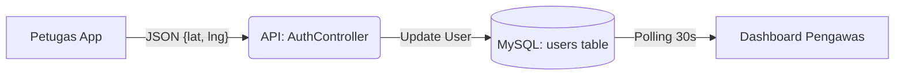

# Skema Pelacakan Lokasi Petugas di Dashboard Pengawas
## Monitoring Real-Time & Audit Lokasi (Update April 2026)

> **Pendekatan: Dual-Track** — Sinkronisasi real-time + sinkronisasi berbasis aksi.
> **Fungsi Utama**: Memastikan petugas berada di zona penagihan/inspeksi yang tepat, mencegah *fraud*, dan memvalidasi keaslian laporan via GPS Snapshot.

---

## 1. Lokasi Real-Time (Live Background Tracking)
Petugas yang sedang aktif (Shift On) akan membagi lokasinya secara periodik.

| Layer | Detail |
|-------|--------|
| **Frontend** | `Geolocation.watchPosition()` dengan `enableHighAccuracy: true` |
| **API** | `PUT /api/user/location` → `AuthController@updateLocation` |
| **Optimasi** | **Live Throttling**: Update dikirim setiap 30-60 detik untuk efisiensi baterai. |

---

## 2. Lokasi Berbasis Aksi (Action-Triggered Snapshot)
Validasi lokasi mutlak saat melakukan transaksi sensitif (Anti-Fake GPS).

| Aksi | Model / Tabel | Field Koordinat |
|------|---------------|-----------------|
| **Registrasi OP** | `TaxObject` | `latitude`, `longitude` |
| **Uji Petik** | `SpotCheck` | `lat`, `lng` (di metadata/items) |
| **Penindakan** | `EnforcementNotice` | `lat`, `lng` |
| **Audit Reklame** | `BillboardAudit` | `lat`, `lng` |

**Geofencing Logic**: Verifikasi apakah posisi petugas berada dalam radius < 100m dari koordinat Objek Pajak saat melakukan aktivitas.

---

## 3. Visualisasi Dashboard Pengawas (Command Center)

| Fitur | Detail Teknis |
|-------|---------------|
| **Petugas Live** | Marker Merah Pulsing di `SupervisorMap.tsx` |
| **Heatmap Potensi** | Intensitas warna berdasarkan `amount` di `TaxObject` |
| **History Route** | Menampilkan rekam jejak harian petugas (BREADCRUMB) |
| **E-Registry Map** | Menampilkan sebaran WP yang sudah TTE vs No-TTE |

---

## 4. Status Implementasi (April 2026)

- [x] **Live Petugas Marker** — Aktif via `/api/pengawas/petugas-locations`.
- [x] **Heatmap Lokasi Potensi** — Integrasi dengan sub-distrik & zona.
- [x] **ESRI Satellite Layer** — Visualisasi presisi bangunan dan reklame.
- [x] **Auto-Refresh Interval** — Dashboard memuat data baru secara otomatis.
- [x] **Photo-GPS Sync** — Foto penindakan menyertakan koordinat EXIF & DB.
- [/] **Zonasi Alert** — Notifikasi saat petugas keluar zona tugas (Testing).
- [ ] **History Playback** — Fitur putar ulang rute harian petugas.

---
*Last modified: April 2026. Command Center Standard.*
