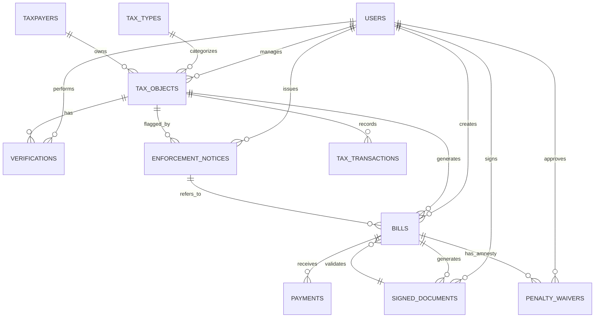

# Database Schema
## Sistem Retribusi dan Pendapatan Daerah (M-PAD)

---

## Entity Relationship Diagram



---

## Tabel DETAIL (Update April 2026)

### 1. tax_objects (Objek Pajak)
*Pembaruan: Penambahan field audit fisik dan sinkronisasi PBB.*

```sql
CREATE TABLE tax_objects (
    id UUID PRIMARY KEY,
    taxpayer_id UUID REFERENCES taxpayers(id),
    retribution_type_id UUID REFERENCES retribution_types(id),
    retribution_classification_id UUID REFERENCES retribution_classifications(id),
    opd_id UUID,
    zone_id UUID,
    
    nop VARCHAR(50) UNIQUE NOT NULL, -- Nomor Objek Pajak
    name VARCHAR(100), -- Nama OP
    address TEXT,
    latitude DECIMAL(10, 8),
    longitude DECIMAL(11, 8),
    
    metadata JSON, -- Data dinamis (jumlah kamar, luas reklame, dll)
    status ENUM('draft', 'proses', 'disetujui', 'ditolak') DEFAULT 'draft',
    
    -- Audit Lapangan
    audit_status VARCHAR(50), -- 'clean', 'anomaly', 'under_review'
    is_verified_physically BOOLEAN DEFAULT FALSE,
    last_photo_url VARCHAR(255),
    installation_date DATE, -- Khusus reklame/alat baru
    
    approved_at TIMESTAMP,
    approved_by UUID REFERENCES users(id),
    timestamps
);
```

### 2. bills (Tagihan / Penetapan)
*Pembaruan: Dukungan Penghapusan Denda (Amnesty) dan Uji Petik.*

```sql
CREATE TABLE bills (
    id UUID PRIMARY KEY,
    tax_object_id UUID REFERENCES tax_objects(id),
    spot_check_id BIGINT REFERENCES spot_checks(id),
    bill_number VARCHAR(50) UNIQUE,
    status ENUM('draft', 'issued', 'paid', 'overdue', 'cancelled'),
    
    -- Financials
    amount DECIMAL(15,2), -- Pokok
    penalty_amount DECIMAL(15,2), -- Denda Berjalan
    waived_penalty_amount DECIMAL(15,2), -- Denda yang Dihapus (Amnesty)
    admin_fee DECIMAL(15,2),
    
    period VARCHAR(20), -- '03/2026'
    due_date TIMESTAMP,
    metadata JSON,
    timestamps
);
```

### 3. enforcement_notices (Penindakan / Surat Paksa)
*Baru: Modul untuk pengawasan ketat dan penagihan paksa.*

```sql
CREATE TABLE enforcement_notices (
    id BIGINT PRIMARY KEY,
    tax_object_id UUID REFERENCES tax_objects(id),
    bill_id UUID REFERENCES bills(id),
    assigned_to UUID REFERENCES users(id), -- Petugas Eksekutor
    number VARCHAR(50) UNIQUE, -- Nomor Surat Paksa / Teguran
    type ENUM('teguran_1', 'teguran_2', 'surat_paksa', 'penyegelan'),
    status ENUM('pending', 'active', 'resolved', 'rejected'),
    
    amount_at_issue DECIMAL(15,2),
    due_date DATE,
    photo_path VARCHAR(255), -- Bukti foto penempelan stiker/segel
    notes TEXT,
    rejection_notes TEXT,
    
    created_by UUID REFERENCES users(id),
    approved_by UUID REFERENCES users(id),
    timestamps
);
```

### 4. penalty_waivers (Amnesty / Penghapusan Denda)
*Baru: Modul permohonan keringanan pajak.*

```sql
CREATE TABLE penalty_waivers (
    id BIGINT PRIMARY KEY,
    bill_id UUID REFERENCES bills(id),
    requested_by UUID REFERENCES users(id),
    approved_by UUID REFERENCES users(id),
    
    reason TEXT, -- Alasan permohonan
    reduction_type ENUM('percentage', 'fixed_amount'),
    reduction_value DECIMAL(15,2),
    status ENUM('pending', 'approved', 'rejected'),
    approval_notes TEXT,
    timestamps
);
```

### 5. signed_documents (E-Registry TTE)
*Baru: Integrasi Tanda Tangan Elektronik (TTE) BSrE.*

```sql
CREATE TABLE signed_documents (
    id UUID PRIMARY KEY,
    document_type VARCHAR(100), -- Model class (App\Models\Bill, etc)
    document_id UUID,
    document_number VARCHAR(50),
    file_path VARCHAR(255), -- Link ke S3/Cloud Storage
    signature_hash TEXT, -- Digital signature hash
    verification_url VARCHAR(255), -- URL untuk QR-Code validation
    status ENUM('pending', 'signed', 'revoked'),
    
    signed_by UUID REFERENCES users(id),
    signed_at TIMESTAMP,
    metadata JSON,
    timestamps
);
```

### 6. tax_transactions (Log Detak Transaksi)
*Pembaruan: Digunakan untuk rekonsiliasi data dari Tapbox.*

```sql
CREATE TABLE tax_transactions (
    id UUID PRIMARY KEY,
    tax_object_id UUID REFERENCES tax_objects(id),
    taxpayer_id UUID REFERENCES taxpayers(id),
    opd_id UUID,
    
    transaction_date DATE,
    amount DECIMAL(15,2),
    tax_amount DECIMAL(15,2),
    source VARCHAR(50), -- 'tapbox', 'manual', 'bank_api'
    description TEXT,
    metadata JSON,
    timestamps
);
```

### 7. complaints (Laporan Pengaduan & Aspirasi)
*Baru: Modul untuk menampung keluhan wajib pajak secara proaktif.*

```sql
CREATE TABLE complaints (
    id BIGINT PRIMARY KEY,
    taxpayer_id UUID REFERENCES taxpayers(id),
    name VARCHAR(255),
    email VARCHAR(255),
    phone VARCHAR(20),
    category VARCHAR(100), -- 'reklame', 'hotel', 'restoran', dll
    complaint_text TEXT,
    rating INTEGER,
    suggestion_text TEXT,
    attachments JSON,
    status ENUM('pending', 'processing', 'resolved', 'rejected'),
    admin_notes TEXT,
    resolved_at TIMESTAMP,
    resolved_by UUID REFERENCES users(id),
    timestamps
);
```

### 8. tax_educations (Materi Edukasi Pajak)
*Baru: Portal informasi peraturan dan panduan pengisian pajak.*

```sql
CREATE TABLE tax_educations (
    id BIGINT PRIMARY KEY,
    title VARCHAR(255),
    slug VARCHAR(255) UNIQUE,
    content TEXT,
    category VARCHAR(100),
    image_url VARCHAR(255),
    is_active BOOLEAN,
    published_at TIMESTAMP,
    timestamps
);
```

### 9. audit_logs (Rekam Jejak Audit)
*Pembaruan: Kepatuhan tinggi terhadap transparansi data.*

```sql
CREATE TABLE audit_logs (
    id BIGINT PRIMARY KEY,
    user_id UUID REFERENCES users(id),
    action VARCHAR(50), -- 'create', 'update', 'delete'
    model_type VARCHAR(100),
    model_id BIGINT,
    old_values JSON,
    new_values JSON,
    ip_address VARCHAR(45),
    user_agent TEXT,
    timestamps
);
```

---

## 10. Referensi Tabel Master Lainnya

- **retribution_types**: 9 Jenis Pajak PBJT + PBB-P2.
- **retribution_classifications**: Sub-kategori dengan tarif spesifik dan `form_schema`.
- **zones**: Data wilayah (Kelurahan/Kecamatan Kota Baubau) untuk GIS mapping.

---

## 11. Perbandingan Modernisasi: Legacy 9pajak vs M-PAD

Berdasarkan analisis file backup `sw_patda_backup.sql`, berikut adalah perbedaan fundamentalnya:

| Fitur | Sistem Lama (9pajak) | Sistem Baru (M-PAD) |
| :--- | :--- | :--- |
| **Arsitektur** | Modular Terpisah (Tabel per jenis pajak) | Unified Pattern (`tax_objects`) |
| **Identifier** | Auto-increment Integer | UUID (Universally Unique ID) |
| **Atribut Objek** | Kolom Fisik Terbatas | **Metadata JSON (Fleksibel)** |
| **Logika Hitung**| Hardcoded di Kode Aplikasi (PHP) | **Formula Parser (Dinamis di DB)** |
| **Audit Trail** | Terbatas pada riwayat transaksi | Full Record (Audit Logs System) |
| **Field Prefix** | Selalu menggunakan `CPM_` | Penamaan standar PSR (Tanpa prefix) |

---
*Last modified: April 2026. Unified Schema M-PAD with Legacy Comparison.*
