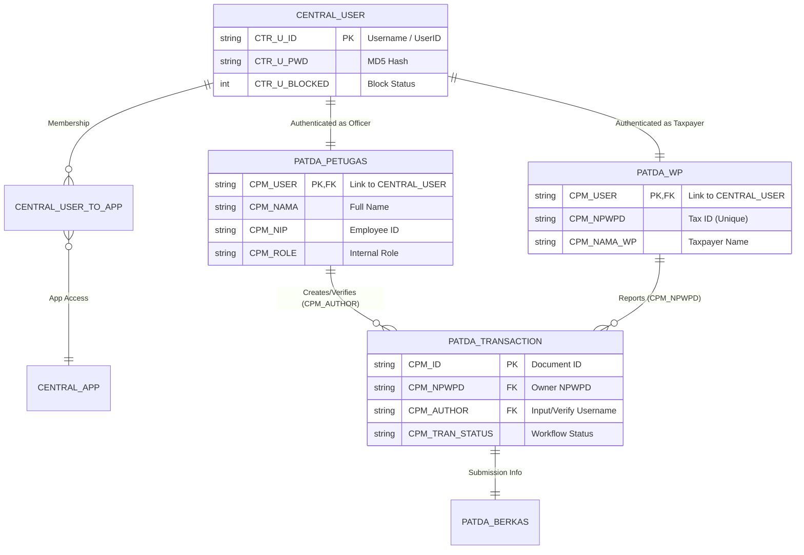

# Legacy Officer Data Mapping (9pajak)

Dokumen ini merangkum hasil ekstraksi data petugas dari sistem legacy `9pajak` untuk keperluan migrasi dan audit internal sistem M-PAD.

## 1. Klasifikasi Peran & Petugas

| Kategori Peran | Akun Petugas (Usernames) | Fungsi Utama |
| :--- | :--- | :--- |
| **Admin & Konfigurasi** | `IRMAWATI`, `RATNAKARMAN`, `LIPUU`, `admin_v-tax` | Manajemen sistem, registrasi operator, backup data. |
| **Pelayanan (Pelapor)** | `muhihsanaris`, `suwarti` | Input data pendaftaran WP (RegWP) dan pelaporan omzet (SPTPD). |
| **Verifikasi &审核** | `syamsir`, `muhihsanaris` | Pemeriksaan kepatuhan data sebelum tagihan diterbitkan. |
| **Penagihan & Lapangan** | `syamsir` | Eksekusi surat teguran/paksa dan monitoring tracking lapangan. |
| **Integrasi Dinas / OPD** | `dinaskesehatan`, `dinaspekerjaanumum`, `dinaspendidikan` | Pelaporan data pajak sektoral per instansi. |

## 3. Skema Relasi Database (Entity Relationship)

Sistem `9pajak` menggunakan arsitektur relasional berbasis username sebagai kunci penghubung lintas modul. Berikut adalah visualisasi relasinya:



### Detail Field Mapping Lintas Tabel:
1.  **Auth & Profile**: `CENTRAL_USER.CTR_U_ID` terhubung langsung dengan `PATDA_PETUGAS.CPM_USER` (untuk internal) atau `PATDA_WP.CPM_USER` (untuk eksternal).
2.  **Audit Trail**: Field `CPM_AUTHOR` pada tabel transaksi (seperti `PATDA_HOTEL_DOC`) merujuk pada `CPM_USER` di tabel petugas.
3.  **Identitas Bisnis**: NPWPD (`CPM_NPWPD`) adalah kunci utama yang menghubungkan riwayat semua jenis pajak (`TRANSACTION`) ke satu subjek pajak (`PATDA_WP`).

## 4. Catatan Migrasi M-PAD

| Legacy User | Proposed M-PAD Role | Keterangan |
| :--- | :--- | :--- |
| `IRMAWATI`, `LIPUU` | `Super Admin` | Tetap memegang otoritas penuh di Dashboard Admin. |
| `muhihsanaris` | `Petugas Pelayanan` | Fokus pada input dan pendaftaran di Admin. |
| `syamsir` | `Petugas Lapangan` | Dipindahkan ke aplikasi Mobile Petugas untuk penindakan (Tier 3). |
| `dinaskesehatan` | `Viewer OPD` | Akses monitoring khusus untuk instansi terkait. |

## 5. Data Mentah (Officer Registry JSON)

Berikut adalah hasil ekstraksi audit jejak transaksi (`CPM_AUTHOR`) dari database legacy untuk keperluan referensi migrasi:

```json
{
  "syamsir_group": {
    "primary": "syamsir",
    "aliases": ["doangsyamsir"],
    "total_activity": 10624,
    "role_prediction": "Field Officer / Verifier",
    "tables": ["PATDA_HOTEL_DOC", "PATDA_RESTORAN_DOC", "PATDA_PARKIR_DOC", "PATDA_PETUGAS", "PATDA_HIBURAN_DOC", "PATDA_WP", "PATDA_REKLAME_DOC"]
  },
  "muhihsanaris_group": {
    "primary": "muhihsanaris",
    "aliases": ["ikhsanicang"],
    "total_activity": 7905,
    "role_prediction": "Back-office Operator",
    "tables": ["PATDA_HOTEL_DOC", "PATDA_RESTORAN_DOC", "PATDA_PARKIR_DOC", "PATDA_PETUGAS", "PATDA_HIBURAN_DOC", "PATDA_WP", "PATDA_REKLAME_DOC"]
  },
  "admin_accounts": [
    {
      "user": "admin_simpatda",
      "activity": 775,
      "tables": ["PATDA_HOTEL_DOC", "PATDA_RESTORAN_DOC", "PATDA_PETUGAS", "PATDA_WP", "PATDA_MINERAL_DOC"]
    },
    {
      "user": "ratnakarman",
      "activity": 810,
      "tables": ["PATDA_HOTEL_DOC", "PATDA_RESTORAN_DOC", "PATDA_WP"]
    }
  ],
  "institutional_accounts": {
    "sekretariatdprd": 1537,
    "dinaskesehatan": 2142,
    "kesbangpol": 887,
    "bappeda": 731,
    "dinasperikanan": 374,
    "dinasperhubungan": 351
  },
  "field_officers_candidates": [
    "syafrilmane",
    "abdwahab",
    "mukmin",
    "maulana",
    "ahmadun"
  ]
}
```

## 6. Koneksi VPS (Database Legacy)

Daftar petugas dan riwayat transaksi kini telah tersedia di VPS Staging untuk keperluan kueri langsung dan verifikasi migrasi M-PAD.

| Parameter | Detail |
| :--- | :--- |
| **Host** | `157.10.252.74` |
| **Database** | `sipanda_legacy_9pajak` |
| **Default Charset** | `latin1` |
| **Penyimpanan** | MySQL (MariaDB) |

**Cara Mengakses (dari VPS):**
```bash
sudo mysql sipanda_legacy_9pajak
```
**Contoh Kueri Audit (M-PAD Context):**
```sql
-- Mencari aktivitas petugas syamsir di tahun 2020
SELECT * FROM PATDA_HOTEL_DOC WHERE CPM_AUTHOR = 'syamsir' AND CPM_TGL_LAPOR LIKE '2020%';
```

---
*Dokumen ini dibuat otomatis sebagai bagian dari fase riset migrasi data M-PAD.*
