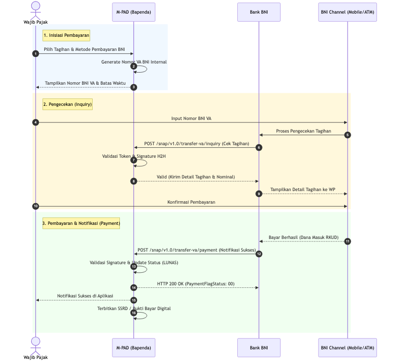

# FLOW BISNIS INTEGRASI BNI - M-PAD
## BADAN PENDAPATAN DAERAH (BAPENDA) KOTA BAUBAU

Dokumen ini menjelaskan alur teknis dan bisnis integrasi pembayaran *Host-to-Host* (H2H) menggunakan standar SNAP BI (Model Biller / Open API) antara sistem **M-PAD** (Manajemen Pendapatan Asli Daerah) Kota Baubau dengan **Bank BNI**.

---

### 1. Inisiasi Pembayaran (Pembuatan VA)
1. **Wajib Pajak (WP)** masuk ke dalam aplikasi M-PAD (melalui Web Admin, Petugas, atau Mobile App) dan memilih tagihan retribusi/pajak daerah yang belum dibayar.
2. Wajib Pajak memilih metode pembayaran **Bank BNI (Virtual Account)**.
3. Sistem **M-PAD (Backend)** meng-generate Nomor *Virtual Account* secara internal yang merupakan kombinasi kode *biller* institusi dan nomor tagihan/SKRD.
4. Aplikasi M-PAD menampilkan **Nomor BNI VA** beserta batas waktu pembayaran kepada Wajib Pajak. *(Pada tahap ini, sistem M-PAD belum melakukan pemanggilan API ke pihak bank).*

### 2. Pengecekan & Pembayaran (Inquiry)
1. Wajib Pajak memasukkan Nomor BNI VA melalui salah satu *channel* pembayaran Bank BNI (BNI Mobile Banking, ATM, BNI Direct, Agen46, atau Teller).
2. Sistem BNI melakukan pengecekan tagihan dengan memanggil *endpoint Inquiry* milik server M-PAD (`POST /snap/v1.0/transfer-va/inquiry`).
3. Server M-PAD memvalidasi token otorisasi H2H (OAuth2 B2B), *Digital Signature*, dan *Timestamp* dari *request* BNI tersebut.
4. Server M-PAD mencari tagihan berdasarkan nomor VA, lalu merespons dengan informasi detail tagihan (Nama WP dan Nominal Pasti).
5. Channel Bank BNI menampilkan detail tagihan kepada Wajib Pajak.
6. Setelah valid, Wajib Pajak menekan tombol bayar/konfirmasi. Saldo WP terpotong dan dana masuk ke rekening (RKUD) Bapenda Kota Baubau di Bank BNI.

### 3. Konfirmasi Otomatis (Payment / Callback)
1. Detik itu juga setelah pembayaran sukses diproses, sistem **BNI** mengirimkan *webhook* notifikasi pembayaran sukses ke *endpoint Payment* M-PAD (`POST /snap/v1.0/transfer-va/payment`).
2. Server **M-PAD** menerima *request* tersebut dan memvalidasi kembali keaslian *Digital Signature* serta *Timestamp*.
3. Server M-PAD memverifikasi bahwa nominal yang ditransfer sudah sesuai dengan nominal tagihan.
4. M-PAD memperbarui status tagihan di dalam *database* menjadi **LUNAS (Paid)**.
5. M-PAD mengirimkan balasan `HTTP 200 OK` ke BNI (dengan *PaymentFlagStatus* sukses) sebagai tanda notifikasi berhasil diterima.

### 4. Penyelesaian & Penerbitan Struk
1. Sistem M-PAD mencatat riwayat transaksi secara mendetail ke dalam *Payment Logs* dan *Virtual Ledger* pemerintah daerah.
2. Wajib Pajak menerima notifikasi di aplikasi M-PAD bahwa pembayaran telah sukses.
3. M-PAD secara otomatis menerbitkan **Bukti Bayar Sah (SSRD / Surat Setoran Retribusi Daerah)** yang dilengkapi dengan QR Code dan dapat diunduh (di-*download*) oleh Wajib Pajak maupun Petugas Bapenda secara *real-time*.

---
*Dokumen ini merupakan lampiran pendukung untuk pengajuan operasional BNI - Bapenda Kota Baubau.*
