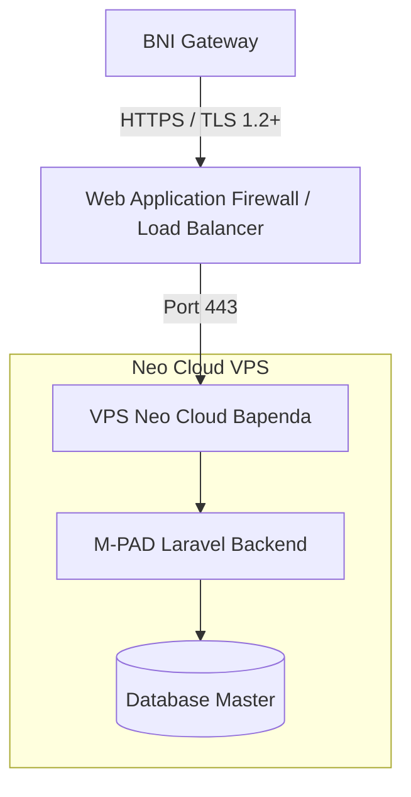

# Topologi & Arsitektur Jaringan (M-PAD Bapenda)

## Arsitektur Aplikasi
Aplikasi M-PAD (Pajak Daerah) dibangun menggunakan arsitektur **Monolithic (MVC)**.
Backend: PHP Laravel 11.
Database: PostgreSQL / MySQL.
Web Server: Nginx.

## Topologi Jaringan

