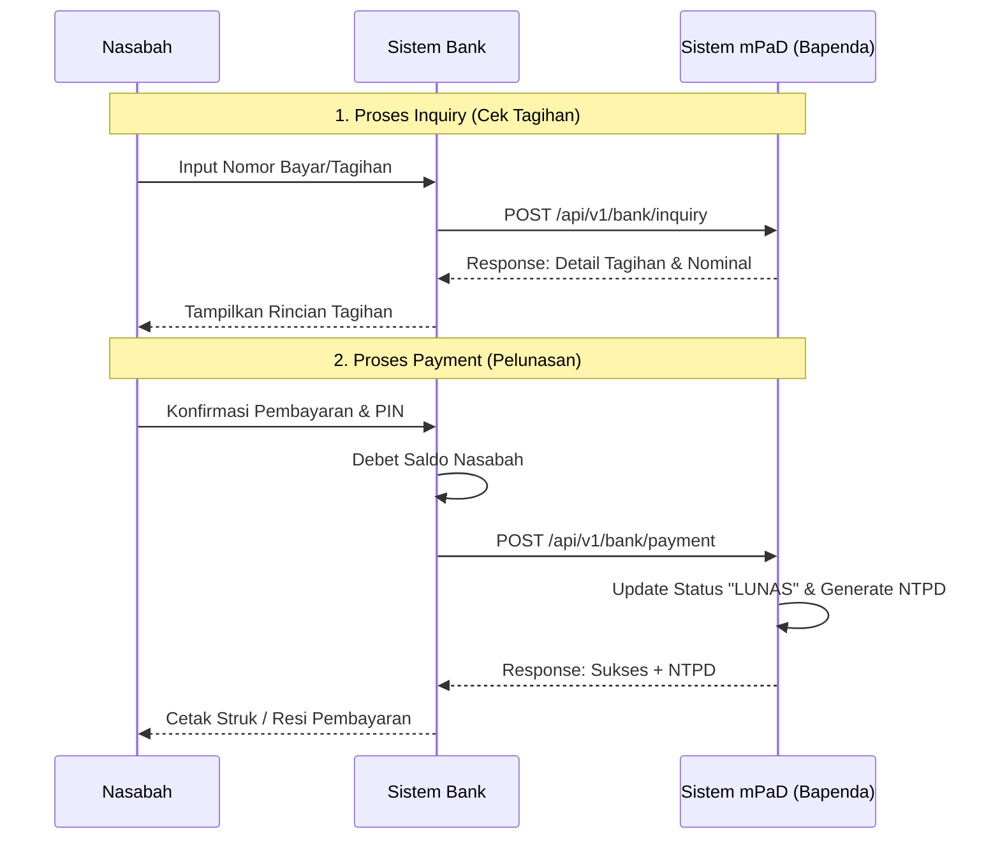

# 🏦 Spesifikasi Teknis Integrasi API H2H mPaD Bapenda
**Versi:** 1.0.0 | **Tanggal:** 7 Juli 2026 | **Pemilik:** Bapenda Kota Baubau (Tim IT mPaD)

Dokumen ini merupakan panduan teknis resmi (*Functional Specification Document* / FSD) untuk mitra Perbankan (Bank Daerah maupun Nasional) yang akan melakukan integrasi sistem pembayaran Retribusi dan Pajak Daerah melalui jalur Host-to-Host (H2H) dengan sistem mPaD Kota Baubau.

---

## 1. Arsitektur & Protokol Keamanan

Semua komunikasi API H2H wajib menggunakan protokol **HTTPS** dan mengimplementasikan **IP Whitelisting** di sisi Firewall Bapenda. Skema autentikasi menggunakan **HMAC-SHA256**.

### 1.1. Header Wajib
Setiap *request* HTTP ke server mPaD harus menyertakan header berikut:

| Header | Deskripsi | Wajib | Contoh |
|:---|:---|:---:|:---|
| `X-Signature` | Tanda tangan digital menggunakan HMAC-SHA256. | Ya | `a1b2c3d4...` |
| `X-Timestamp` | Waktu saat request dikirim (format ISO 8601). | Ya | `2026-07-07T10:00:00Z` |
| `Accept` | Format respon yang diterima. | Ya | `application/json` |

### 1.2. Rumus Pembentukan Signature
Signature dihitung menggunakan kunci rahasia (**Secret Key**) yang dibagikan secara aman secara *offline* kepada pihak Bank.

```javascript
// 1. Siapkan data yang akan dienkripsi (gabungan string)
// Untuk Inquiry: amount = 0
data_string = bill_number + timestamp + amount;

// 2. Generate HMAC-SHA256
signature = HMAC_SHA256(data_string, secret_key);
```

---

## 2. Alur Transaksi (Sequence Diagram)

Berikut adalah visualisasi standar pertukaran data antara Sistem Bank dan Sistem mPaD.



---

## 3. Spesifikasi Endpoint API

**Base URL (Sandbox/UAT):** `https://api.mpad.online`  
**Base URL (Production):** `https://apimpad.baubaukota.go.id`  

### 3.1. Inquiry (Cek Tagihan)
Digunakan oleh Bank untuk mengambil detail tagihan berdasarkan nomor bayar yang diinput oleh WP (Wajib Pajak).

- **URL**: `POST /api/v1/bank/inquiry`
- **Body Request**:
```json
{
  "bill_number": "PBJT-202601-XX"
}
```
- **Response (200 OK - Tagihan Ditemukan)**:
```json
{
  "status": "success",
  "response_code": "00",
  "data": {
    "bill_number": "PBJT-202601-XX",
    "taxpayer_name": "MUHDAN FYAN",
    "tax_object": "RUMAH MAKAN SEDAP",
    "period": "2026-01",
    "amount_pokok": 1000000,
    "penalty_amount": 20000,
    "total_amount": 1020000,
    "due_date": "2026-02-15 23:59:59"
  }
}
```

### 3.2. Payment Notification (Pelunasan)
Digunakan oleh Bank untuk memberitahukan mPaD bahwa dana Nasabah telah berhasil didebet. **Endpoint ini bersifat *Idempotent*.**

- **URL**: `POST /api/v1/bank/payment`
- **Body Request**:
```json
{
  "bill_number": "PBJT-202601-XX",
  "amount_paid": 1020000,
  "transaction_id": "NTB-12345678",
  "channel": "MOBILE_BANKING",
  "payment_date": "2026-07-07 10:15:00"
}
```
- **Response (200 OK - Pembayaran Sukses)**:
```json
{
  "status": "success",
  "response_code": "00",
  "data": {
    "ntpd": "NTPD-20260707-ABC123XYZ",
    "bill_number": "PBJT-202601-XX",
    "status": "LUNAS"
  }
}
```

### 3.3. Reversal (Pembatalan)
Digunakan oleh Bank apabila terjadi kegagalan (misal timeout koneksi) *setelah* mengirimkan *Payment*, sehingga transaksi harus dibatalkan/di-rollback.

- **URL**: `POST /api/v1/bank/reversal`
- **Body Request**:
```json
{
  "transaction_id": "NTB-12345678",
  "reason": "Technical Timeout at Bank Switch"
}
```
- **Response (200 OK)**:
```json
{
  "status": "success",
  "response_code": "00",
  "message": "Reversal berhasil diproses, tagihan kembali ke status BELUM BAYAR"
}
```

---

## 4. Daftar Response Code (RC) Standar

Untuk memudahkan *mapping* dengan sistem Core Banking, mPaD mengadopsi standar *Response Code* ISO 8583 (dimodifikasi):

| RC | HTTP Status | Keterangan | Tindakan Mitra Bank |
|:---:|:---:|:---|:---|
| **00** | `200` | Sukses / Approved | Tampilkan rincian / Terbitkan Struk |
| **05** | `401` | Unauthorized (Signature salah) | Periksa *Secret Key* atau sinkronisasi waktu |
| **14** | `422` | Tagihan Sudah Terbayar / Lunas | Tolak transaksi, informasikan ke WP |
| **54** | `404` | Nomor Tagihan Tidak Ditemukan | Periksa input nomor bayar |
| **55** | `422` | Nominal Pembayaran Tidak Sesuai | Pastikan `amount_paid` = `total_amount` |
| **88** | `403` | IP Address Tidak Terdaftar | Hubungi Tim IT mPaD untuk open firewall |
| **99** | `500` | Internal Server Error / Timeout | Lakukan retri (*Reversal* jika Payment menggantung) |

---

## 5. Mekanisme Rekonsiliasi & Settlement

1. **Waktu Cut-Off:** Cut-off transaksi harian mPaD adalah pukul **23:59:59 WITA**.
2. **File Rekonsiliasi (H+1):** 
   - Pihak Bank menyediakan *File Rekon* (.txt/.csv) atau endpoint SFTP yang berisi daftar transaksi sukses (NTB, Nomor Bayar, Nominal, Waktu).
   - Sistem mPaD akan menarik/mengolah file tersebut setiap pukul 02:00 WITA.
3. **Penanganan Selisih (Discrepancy):** 
   - Transaksi ada di Bank, tapi tidak ada di mPaD $\rightarrow$ mPaD akan meng-update status menjadi Lunas secara manual/otomatis.
   - Transaksi ada di mPaD, tapi batal di Bank $\rightarrow$ mPaD akan membatalkan tagihan.

---

## 6. Skenario UAT & Sandboxing

Sebelum *Go-Live*, tim teknis Bank diwajibkan melakukan *User Acceptance Test* (UAT) di *Environment Sandbox* mPaD dengan menyelesaikan *Test Case* berikut:

| Skenario UAT | Nomor Bayar (Dummy) | Hasil yang Diharapkan |
|:---|:---|:---|
| Skenario Normal (Inquiry $\rightarrow$ Bayar) | `DUMMY-0001` | Sukses, NTPD terbit. |
| Tagihan Sudah Lunas | `DUMMY-LUNAS-02` | Ditolak, RC 14. |
| Nomor Tidak Ditemukan | `DUMMY-INVALID-9`| Ditolak, RC 54. |
| Bayar Kurang dari Total Tagihan | `DUMMY-KURANG-5` | Ditolak, RC 55. |
| Reversal Flow | `DUMMY-0003` | Inquiry Sukses $\rightarrow$ Payment Sukses $\rightarrow$ Reversal Sukses $\rightarrow$ Inquiry tagihan menjadi *Belum Bayar*. |

---

## 7. Kanal Eskalasi & Support

Jika terjadi kendala integrasi atau *downtime* pada sistem *Production*, tim Bank dapat menghubungi PIC Bapenda Kota Baubau berikut:

- **Helpdesk Teknis mPaD:** (Diisi Nomor WA/Email Helpdesk)
- **Email Surat Resmi:** bapenda@baubaukota.go.id
- **Waktu Layanan Integrasi:** Senin - Jumat (08:00 - 16:00 WITA)

> [!CAUTION]
> Segala pertukaran **Secret Key** dan IP *Whitelisting Production* tidak boleh dikirim melalui grup WhatsApp atau *channel* tidak terenkripsi, melainkan dikirim melalui Email Resmi instansi.
