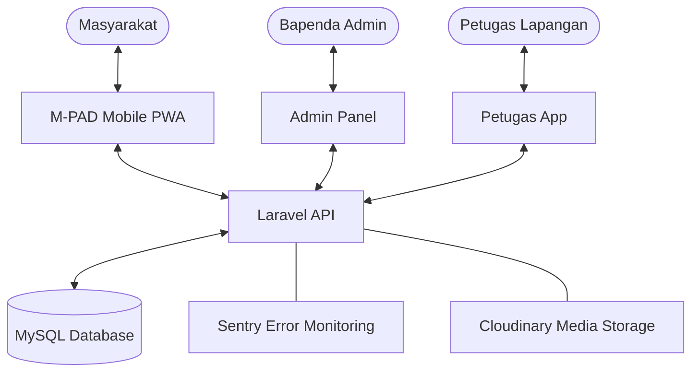

# 🏛️ M-PAD: System Overview & Architecture

Dokumen ini menjelaskan arsitektur, proses sinkronisasi, dan cara kerja sistem **M-PAD (Manajemen Integrasi Tax, Retribusi, dan Aset Daerah)**.

## 1. Arsitektur Sistem

Sistem M-PAD terdiri dari 4 komponen utama yang saling terintegrasi:

- **Backend (API):** Menggunakan **Laravel 11** sebagai pusat logika bisnis, manajemen database (MySQL), dan penyedia data melalui RESTful API.
- **Frontend Admin:** Dashboard berbasis **React (Vite)** untuk pengelola (BAPENDA) untuk manajemen data master, zonasi, dan laporan.
- **Frontend Mobile:** Aplikasi PWA berbasis **React (Vite)** untuk masyarakat (Wajib Pajak) melakukan pendaftaran, pengecekan tagihan, dan simulasi pajak.
- **Frontend Petugas:** Aplikasi berbasis **React (Vite)** khusus untuk petugas lapangan untuk melakukan pengawasan dan input data potensi.

### Diagram Aliran Data

## 2. Environment & Domain

Sistem dipisahkan menjadi dua lingkungan utama untuk memastikan stabilitas:

| Environment | API URL | Frontend URL (Mobile) | Tujuan |
| :--- | :--- | :--- | :--- |
| **Production** | `api.sipanda.online` | `sipanda.online` | Penggunaan nyata oleh publik & OPD. |
| **Development** | `api-dev.sipanda.online` | `dev.sipanda.online` | Uji coba fitur baru sebelum rilis. |

## 3. Skema Sinkronisasi (Deployment)

Sinkronisasi file menggunakan alur **Git-Flow** otomatis melalui **GitHub Actions**:

1. **Lokal:** Development dilakukan di komputer lokal ( folder `Herd`).
2. **Push GitHub:** Kode di-push ke branch `dev` atau `main`.
3. **GitHub Actions:**
   - **Backend:** SSH langsung ke VPS, melakukan `git pull`, `composer install`, dan `migrate`.
   - **Frontend:** Build aplikasi secara otomatis, lalu mengirimkan folder `dist/` ke VPS menggunakan SCP.
4. **VPS Update:** File di VPS diperbarui, cache dibersihkan, dan sistem online dengan versi terbaru.

## 4. Cara Kerja Fitur Utama

### A. Autentikasi
Menggunakan **Laravel Sanctum**. User (Masyarakat/Admin/Petugas) login menggunakan NIK atau Email. Sistem memberikan **Bearer Token** yang disimpan di browser untuk otorisasi request selanjutnya.

### B. Manajemen Retribusi & Pajak
- **Zonasi:** Data dikelompokkan berdasarkan wilayah koordinat (Latitude/Longitude).
- **Billing:** Tagihan digenerate berdasarkan jenis retribusi (Parkir, Sampah, Pasar, dll).
- **Payment:** Saat ini mendukung pencatatan status pembayaran (Lunas/Pending) yang terintegrasi dengan data wajib pajak.

### C. Keamanan & Stabilitas
- **CORS:** Diatur ketat di sisi Nginx dan Laravel agar hanya domain resmi (`*.sipanda.online`) yang bisa mengakses API. Penanganan `OPTIONS` preflight dilakukan di level Nginx untuk mencegah "Duplicate Header".
- **Branding PWA:** Nama aplikasi telah diperbarui menjadi **M-PAD** (Mitra PAD) dengan ikon yang dioptimalkan sesuai standar PWA (192, 512, apple-touch) dan latar belakang putih.
- **Monitoring:** Terintegrasi dengan **Sentry** untuk memantau error secara real-time.
- **Verifikasi Sistem:** Dilengkapi dengan suite pengujian otomatis (`testing/`) yang mencakup 69 skenario CRUD dan 27 audit keamanan infrastruktur.

## 5. Log Keputusan Penting (Februari 2026)

| Tanggal | Aktivitas | Detail Teknis |
| :--- | :--- | :--- |
| 25 Feb | **Stabilisasi API** | Fix error 500 di `bootstrap/app.php` (PHP syntax compatibility) dan perbaikan permission folder `storage` & `bootstrap/cache`. |
| 25 Feb | **Optimalisasi CORS** | Pemisahan header CORS: Nginx menangani `OPTIONS`, Laravel menangani request utama. |
| 26 Feb | **Unified Sync** | Sinkronisasi penuh 8 domain (Production & Dev) dari Local -> GitHub -> VPS. Semua environment kini menggunakan owner `www-data`. |
| 26 Feb | **Audit Keamanan** | Menjalankan `test_penetration.sh`, mengamankan akses file `.env`, dan memverifikasi proteksi IDOR. |
| 02 Mar | **Stable Baseline** | Penetapan ID Commit stabil untuk semua repo (`retribusi-api`: `7b7388c`). Lihat [STABLE_BASELINE.md](file:///Users/pondokit/Herd/retribusi-api/docs/STABLE_BASELINE.md). |

---
*Dokumen ini adalah sumber kebenaran (Source of Truth) untuk konteks proyek M-PAD. Terakhir diperbarui: 26 Februari 2026.*
