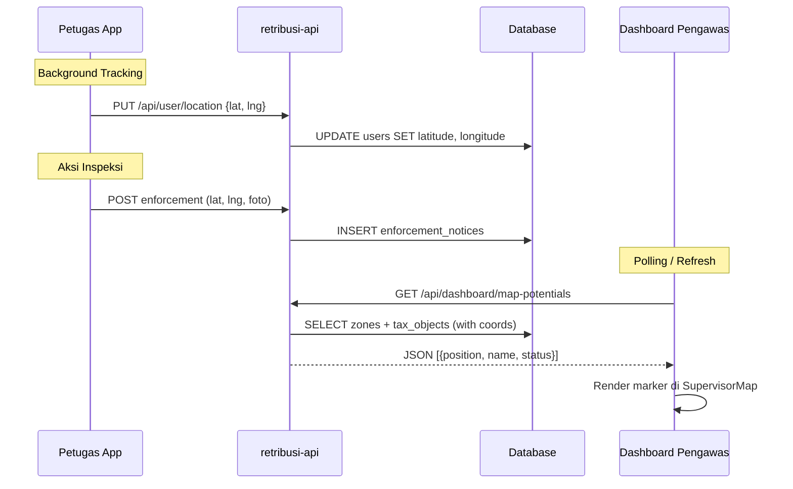

# Skema Pelacakan Lokasi Petugas di Dashboard Pengawas

> **Pendekatan: Dual-Track** — Sinkronisasi real-time + sinkronisasi berbasis aksi
> **Fungsi Utama**: Fitur pelacakan digunakan oleh *Pengawas* untuk memastikan petugas di lapangan berada di zona penagihan yang benar, mencegah kebocoran potensi pendapatan dengan verifikasi lokasi saat mencetak bukti bayar, dan menindaklanjuti ketidakteraturan (anomali laporan) secara instan via *Command Center*.

---

## 1. Sinkronisasi Real-Time (Background Tracking)

Ketika petugas membuka aplikasi, browser memantau perubahan koordinat secara aktif.

| Layer | Detail |
|-------|--------|
| **Frontend** | `navigator.geolocation.watchPosition()` di `retribusi-petugas` |
| **API** | `PUT /api/user/location` → `AuthController@updateLocation` |
| **Database** | Kolom `latitude`, `longitude` di tabel `users` |

```
┌─────────────────────┐     PUT /api/user/location     ┌──────────────┐
│  retribusi-petugas   │ ─────────────────────────────► │  retribusi-api│
│  watchPosition()     │    { latitude, longitude }     │  users table  │
└─────────────────────┘                                 └──────────────┘
```

**File terkait:**
- `retribusi-api/app/Http/Controllers/AuthController.php` → `updateLocation()`
- `retribusi-api/database/migrations/2026_02_26_094037_add_location_to_users_table.php`
- `retribusi-api/app/Models/User.php` → fillable `latitude`, `longitude`

---

## 2. Sinkronisasi Berbasis Aksi (Snapshot Verification)

Ketika petugas melakukan tugas spesifik (inspeksi, update data WP, buat titik peta baru).

| Layer | Detail |
|-------|--------|
| **Frontend** | `getCurrentPosition()` + foto lokasi di form inspeksi/peta |
| **Database** | Kolom `lat`, `lng` di `enforcement_notices`; `latitude`, `longitude` di `tax_objects` |
| **Validasi** | GPS Anti-Fake Engine (perbandingan jarak target vs posisi aktual) |

**File terkait:**
- `retribusi-petugas/src/pages/FieldInspection.tsx` — inspeksi lapangan dengan GPS + foto
- `retribusi-petugas/src/pages/PetaLapangan.tsx` — peta lapangan interaktif
- `retribusi-petugas/src/components/MapPicker.tsx` — picker koordinat

---

## 3. Visualisasi di Dashboard Pengawas

Dashboard admin menggabungkan semua data lokasi ke dalam peta interaktif.

| Komponen | Detail |
|----------|--------|
| **Halaman** | `PengawasDashboard.tsx` & `PengawasMaps.tsx`— memanggil `/api/dashboard/map-potentials` dan `/api/pengawas/petugas-locations` |
| **Peta** | `SupervisorMap.tsx` — Leaflet.js dengan kontrol Layers (OSM Jalan & Satelit ESRI) |
| **API** | `DashboardController@getMapPotentials` & `SurveillanceController@getPetugasLocations` |

### Legenda Marker Peta (via `mapUtils.ts`)

| Warna | Arti |
|-------|------|
| 🔵 Biru | Lokasi pengawas pembuka peta (real-time) |
| 🟡 Kuning | Zona potensi retribusi radius |
| 🟢 Hijau | WP patuh (lunas) |
| 🔴 Merah | WP menunggak / Tunggakan aktif |
| 🟢 Zamrud | Lokasi Petugas Penagih Lapangan (Animasi pulse) |
| 🔴 Merah Terang | Indikasi Anomali Transaksi (Animasi peringatan) |

---

## 4. Alur Data End-to-End



---

## 5. Status Implementasi Fitur (Command Center / Peta)

- [x] **Live petugas marker di peta pengawas** — Tersedia via endpoint `/api/pengawas/petugas-locations` dengan tracking per OPD. Ditampilkan secara tersentralisasi pada `PengawasMaps.tsx` dan `Dashboard.tsx`.
- [x] **Sinkronisasi Icon Peta (WP/Petugas)** — Semua marker untuk Wajib Pajak kini disamakan di seluruh dasbor dengan menggunakan `src/lib/mapUtils.ts` (menampilkan avatar WP, status pembayaran, dan lencana kelas PBB).
- [x] **Mode Satelit (ESRI)** — Toggle Layer ditambahkan ke Peta Admin dan Peta Pengawas untuk melengkapi Map Standard (OSM).
- [x] **Auto-refresh interval** — Polling otomatis berjalan setiap 30 detik untuk menarik update posisi live riwayat petugas.
- [ ] **Background location sync tertutup** — Throttling update API di background OS mobile.
- [ ] **Geofencing alert** — Trigger notifikasi jika keluar area.
- [ ] **Riwayat lokasi** — Tracking route historikal `user_location_history`.
