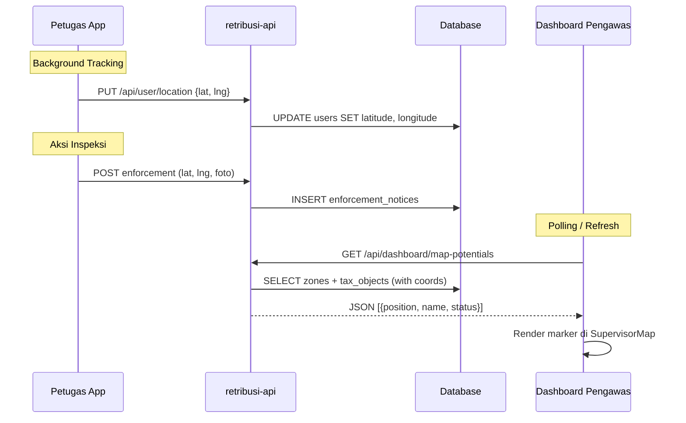

# Skema Pelacakan Lokasi Petugas di Dashboard Pengawas

> **Pendekatan: Dual-Track** — Sinkronisasi real-time + sinkronisasi berbasis aksi

---

## 1. Sinkronisasi Real-Time (Background Tracking)

Ketika petugas membuka aplikasi, browser memantau perubahan koordinat secara aktif.

| Layer | Detail |
|-------|--------|
| **Frontend** | `navigator.geolocation.watchPosition()` di `retribusi-petugas` |
| **API** | `PUT /api/user/location` → `AuthController@updateLocation` |
| **Database** | Kolom `latitude`, `longitude` di tabel `users` |

```
┌─────────────────────┐     PUT /api/user/location     ┌──────────────┐
│  retribusi-petugas   │ ─────────────────────────────► │  retribusi-api│
│  watchPosition()     │    { latitude, longitude }     │  users table  │
└─────────────────────┘                                 └──────────────┘
```

**File terkait:**
- `retribusi-api/app/Http/Controllers/AuthController.php` → `updateLocation()`
- `retribusi-api/database/migrations/2026_02_26_094037_add_location_to_users_table.php`
- `retribusi-api/app/Models/User.php` → fillable `latitude`, `longitude`

---

## 2. Sinkronisasi Berbasis Aksi (Snapshot Verification)

Ketika petugas melakukan tugas spesifik (inspeksi, update data WP, buat titik peta baru).

| Layer | Detail |
|-------|--------|
| **Frontend** | `getCurrentPosition()` + foto lokasi di form inspeksi/peta |
| **Database** | Kolom `lat`, `lng` di `enforcement_notices`; `latitude`, `longitude` di `tax_objects` |
| **Validasi** | GPS Anti-Fake Engine (perbandingan jarak target vs posisi aktual) |

**File terkait:**
- `retribusi-petugas/src/pages/FieldInspection.tsx` — inspeksi lapangan dengan GPS + foto
- `retribusi-petugas/src/pages/PetaLapangan.tsx` — peta lapangan interaktif
- `retribusi-petugas/src/components/MapPicker.tsx` — picker koordinat

---

## 3. Visualisasi di Dashboard Pengawas

Dashboard admin menggabungkan semua data lokasi ke dalam peta interaktif.

| Komponen | Detail |
|----------|--------|
| **Halaman** | `PengawasDashboard.tsx` — memanggil `/api/dashboard/map-potentials` |
| **Peta** | `SupervisorMap.tsx` — Leaflet.js + OpenStreetMap |
| **API** | `DashboardController@getMapPotentials` — gabungkan zona + objek pajak |

### Legenda Marker Peta

| Warna | Arti |
|-------|------|
| 🔵 Biru | Lokasi pengawas (real-time dari browser) |
| 🟡 Kuning | Zona potensi retribusi |
| 🟢 Hijau | WP patuh (lunas) |
| 🔴 Merah | WP menunggak |

---

## 4. Alur Data End-to-End



---

## 5. TODO: Fitur yang Belum Diimplementasi

- [ ] **Live petugas marker di peta pengawas** — Endpoint khusus untuk query posisi terakhir semua petugas (`GET /api/pengawas/petugas-locations`) dan tampilkan sebagai marker terpisah di `SupervisorMap`
- [ ] **Auto-refresh interval** — Polling otomatis setiap 30 detik untuk update posisi petugas
- [ ] **Background location sync di app petugas** — `watchPosition` + throttle update ke API dari Layout/App level (bukan hanya di halaman tertentu)
- [ ] **Riwayat lokasi** — Tabel `user_location_history` untuk menyimpan jejak pergerakan petugas
- [ ] **Geofencing alert** — Notifikasi otomatis jika petugas keluar dari zona tugas
